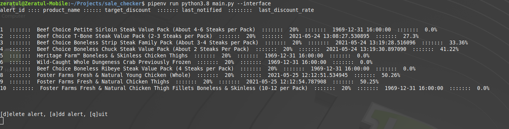

<h2>Use</h2>
Create a watchlist of items to monitor for sales. Because the program is intended to be a schduled task, the default
invocation with no parameters is not interactive. Every item on the watch list is price checked. All items meeting
the criteria are forwarded on to the recipient list (see: communication details). An email alert is sent if
the threshold is met and: 

1) It's been at least 7 days since the item triggered an alert; or 
2) The sale price has gotten even better
  

Invoking the program with the --interface switch provides a TUI for managing the watch list. Items are added using
their UPC (available on Kroger's websites) and specifying a sale threshold as a percentage. 

<h2>Required Environment Variables</h2>

<h3>API values</h3>

* <b>kroger_api_location_id</b>: Use the [Locations](https://developer.kroger.com/reference/#tag/Locations) endpoint to locate the desired store.
* <b>sale_checker_client_id</b>: [Register an app](https://developer.kroger.com/)
* <b>sale_checker_client_secret</b>: [Register an app](https://developer.kroger.com/)

<h3>Communication details</h3>
Uses Google's SMTP work flow for sending alert emails

* <b>ip_alert_email</b>: Gmail account to send emails from e.g. example@gmail.com
* <b>ip_alert_email_pw</b>: A special password for non-humans.  Google Account -> Security -> App passwords
* <b>sale_checker_recipients</b>: semi-colon delineated field of email addresses
